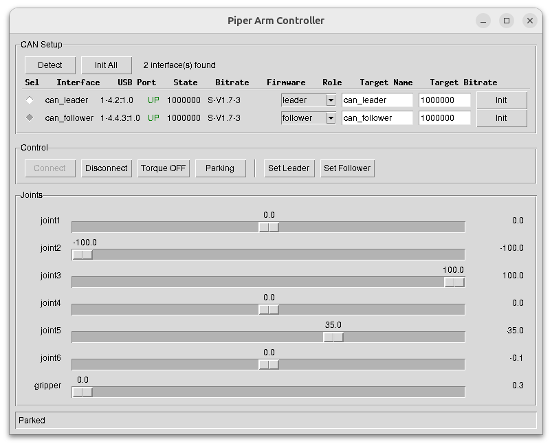
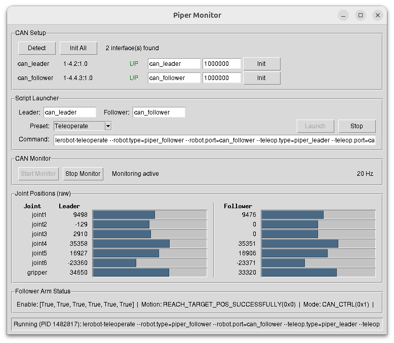
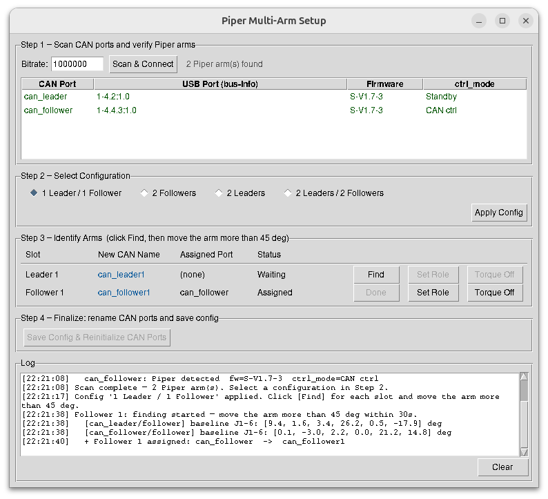

# lerobot_robot_piper

LeRobot plugin for the **Agilex Piper** 7-DOF robotic arm. Provides follower (robot) and leader (teleoperator) interfaces that integrate directly with the [LeRobot](https://github.com/huggingface/lerobot) framework for teleoperation, dataset recording, and autonomous policy deployment.

---

## Features

- **Leader-Follower Teleoperation**: Mirror a leader arm's movements onto a follower arm in real time
- **Dataset Recording**: Collect episodes (joint positions + camera frames) for imitation learning
- **CAN Bus Communication**: Direct hardware control via `piper_sdk` and `wego_piper`
- **Safety Limits**: Configurable `max_relative_target` to cap per-step joint movement
- **Camera Integration**: Attach multiple USB cameras as observations on the follower
- **GUI Tools**: Tkinter-based UIs for direct control (`piper-ui`) and teleoperation monitoring (`piper-monitor`)

---

## Requirements

- Python >= 3.10
- LeRobot >= 0.3.0
- [`piper_sdk`](https://github.com/agilexrobotics/piper_sdk)
- [`wego_piper`](https://github.com/agilexrobotics/wego_piper)
- CAN-USB interface connected to the Piper arm

```bash
pip install lerobot_robot_piper
```

Or install from source:

```bash
git clone <repo-url>
cd lerobot_robot_piper
pip install -e .
```

---

## Hardware Setup

### CAN Interface Initialization

Before connecting, each CAN interface must be brought up. Use the bundled GUI or run manually:

```bash
# Bring up a CAN interface (e.g., can0 at 1 Mbps)
sudo ip link set can0 type can bitrate 1000000
sudo ip link set can0 up
```

The `piper-ui` and `piper-monitor` GUIs can detect available CAN interfaces and initialize them automatically.

### Wiring

| Arm | Interface |
|-----|-----------|
| Follower (robot) | e.g., `can0` |
| Leader (human input) | e.g., `can1` |

---

## GUI Tools





### `piper-setup` — Multi-Arm Setup Wizard

Run this first when setting up multiple arms.

```bash
piper-setup
```

4-step wizard for configuring up to 4 arms:

1. **Scan** — detect all CAN ports, initialize, connect, and read firmware version from each arm
2. **Config** — select arm configuration (1 Leader/1 Follower, 2 Followers, 2 Leaders, 2 Leaders/2 Followers)
3. **Identify** — click `Find` for each slot, then physically move the target arm more than 45° to assign it; use `Set Role` to apply leader/follower mode and `Torque Off` to release the arm
4. **Finalize** — rename CAN ports to canonical names (`can_leader1`, `can_follower1`, etc.) and save `~/piper_config.json`

### `piper-ui` — Direct Control

```bash
piper-ui
```

- **CAN Setup**: detect interfaces, view firmware version and USB port per interface, select role (leader/follower), initialize bitrate
- **Connect**: select a port via radio button, then click Connect — sliders automatically sync to the arm's current joint positions
- **Torque**: toggle torque on/off; sliders and Parking are disabled while torque is off
- **Set Leader / Set Follower**: apply `MasterSlaveConfig` to switch the arm between teaching input mode and motion output mode
- **Parking**: move the arm to the home position (joint values: 0, −100, 100, 0, 35, 0, 0)
- **Joints**: drag sliders to move joints in real time (only active when torque is on); live position readout next to each slider

### `piper-monitor` — Teleoperation Monitor

```bash
piper-monitor
```

- Detect and initialize CAN interfaces
- Launch pre-configured teleoperation/recording commands
- Real-time joint position bars for both arms (leader & follower)
- Follower arm status (enable state, motion status, error codes)

---

## Quick Start

### 1. Python API

```python
from lerobot_robot_piper import PiperFollowerConfig, PiperLeaderConfig, PiperFollower, PiperLeader

follower_cfg = PiperFollowerConfig(port="can0")
leader_cfg   = PiperLeaderConfig(port="can1")

follower = PiperFollower(follower_cfg)
leader   = PiperLeader(leader_cfg)

follower.connect()
leader.connect()

try:
    while True:
        action = leader.get_action()        # read leader joint positions
        follower.send_action(action)        # mirror to follower
        obs = follower.get_observation()    # read follower state + cameras
finally:
    follower.disconnect()
    leader.disconnect()
```

### 2. LeRobot CLI

```bash
# Teleoperate
python -m lerobot.teleoperate \
    --robot.type=piper_follower \
    --robot.port=can0 \
    --teleop.type=piper_leader \
    --teleop.port=can1

# Record a dataset
python -m lerobot.record \
    --robot.type=piper_follower \
    --robot.port=can0 \
    --teleop.type=piper_leader \
    --teleop.port=can1 \
    --dataset-id=my_piper_dataset
```

---

## Configuration

### PiperFollowerConfig

| Parameter | Type | Default | Description |
|-----------|------|---------|-------------|
| `port` | `str` | `"can0"` | CAN port for the follower arm |
| `disable_torque_on_disconnect` | `bool` | `True` | Disable motors when disconnecting |
| `cameras` | `dict[str, CameraConfig]` | `{}` | Named cameras for observation |
| `max_relative_target` | `float \| dict \| None` | `None` | Max per-step joint movement (safety limit) |

### PiperLeaderConfig

| Parameter | Type | Default | Description |
|-----------|------|---------|-------------|
| `port` | `str` | `"can1"` | CAN port for the leader arm |
| `gripper_open_pos` | `float` | `50.0` | Position value representing gripper fully open |

---

## Motor Configuration

The Piper arm has 7 joints. Normalization maps raw encoder counts to the ranges shown below.

| Joint | Model | Normalized Range | Physical Range |
|-------|-------|-----------------|----------------|
| Joint 1 | AGILEX-M | −100 to +100 | ±150° |
| Joint 2 | AGILEX-M | −100 to +100 | 0–180° |
| Joint 3 | AGILEX-M | −100 to +100 | −170–0° |
| Joint 4 | AGILEX-S | −100 to +100 | ±100° |
| Joint 5 | AGILEX-S | −100 to +100 | ±65° |
| Joint 6 | AGILEX-S | −100 to +100 | ±100–130° |
| Gripper | AGILEX-S | 0 to 100 | 0–68° |

The parking (home) position in normalized values: `0, −100, 100, 0, 35, 0, 0`.

---

## Project Structure

```
lerobot_robot_piper/
├── config_piper.py          # PiperFollowerConfig
├── config_piper_leader.py   # PiperLeaderConfig
├── piper_follower.py        # PiperFollower (Robot)
├── piper_leader.py          # PiperLeader (Teleoperator)
├── ui.py                    # piper-ui entrypoint
├── teleop_ui.py             # piper-monitor entrypoint
├── arm_setup_ui.py          # piper-setup entrypoint (multi-arm wizard)
└── motors/
    ├── piper_motors_bus.py  # CAN bus abstraction
    └── tables.py            # Motor model tables
```

---

## License

Apache-2.0
